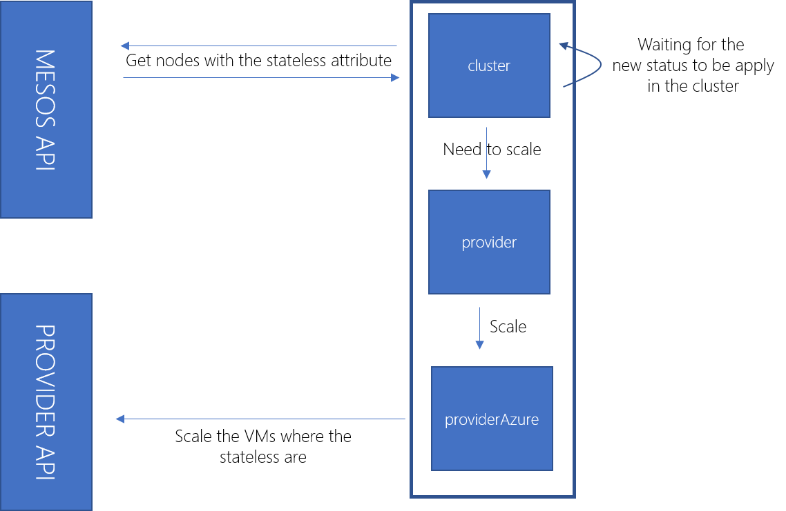

# dcos-autoscaler

## !! In development !!

Experimental project

Autoscaling a DCOS cluster hosted in a cloud provider, either Private or Public, by specifying options.


!! In development using Microsoft Azure, but more that welcome to have contribution for AWS, GCE and others providers...

| Option | Description | Default |
|---|---|---|
| --provider-name | provider who host the cluster. ex: Azure, GCE, AWS... |   |
| --timer | time in seconds between successive checks | 60 |
| --scale-up-cap | Threshold to kick the scale Up in percentage | 80 |
| --scale-down-cap | Threshold to kick the scale Down in percentage | 20 |
| --scale-max | Maximum nodes limitation to scale | 20 |
| --scale-min | Minimum nodes limitation to scale | 3 |
| --azure-subscription-id | Azure Subscription ID |   |
| --azure-tenant-id | Azure Tenant ID |   |
| --azure-client-id | Azure Client ID |   |
| --azure-client-secret | Azure Client Secret |   |
| --azure-location | Azure DC Location |   |
| --azure-resource-group | Azure Resource Group |   |
| --azure-vmss-name | Azure VMSS Name to scale |   |
| --v --vv --vvv | The debug noise level | -vv |

High level orverview of the very simple code architecture :



### Example for Microsoft Azure :

Documentation in progress...

In this example, you:
* [Create a SPN](https://docs.microsoft.com/en-us/azure/azure-resource-manager/resource-group-create-service-principal-portal) in your Azure Subscription.
* Deployed a DC/OS cluster, Manually, or using ACS it doesn't matter, you just have to use VMSS
* [Added a custom mesos attribute on the nodes](https://dcos.io/docs/1.8/administration/faq/#q-how-to-add-mesos-attributes-to-nodes-to-use-marathon-constraints-) that you want to scale


```
python main.py -vv 
    --provider-name Azure 
    --azure-subscription-id 8f26a68d-8613-4a0c-a2a6-2d2d0e261910
    --azure-tenant-id 333c7f36-ba66-49f1-9d8a-a450816e8516
    --azure-client-id 5308694f-bed6-494a-9c19-335b3c40b8b3
    --azure-client-secret myP@ssw0rd1!
    --azure-resource-group myResourceGroup
    --azure-vmss-name dcos-agentprivsl-1453224-vmss
```
### TO DO :
- [ ] Tests
- [ ] Documentation
- [ ] CI